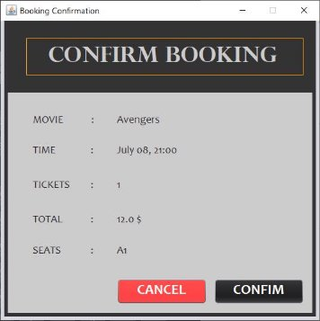
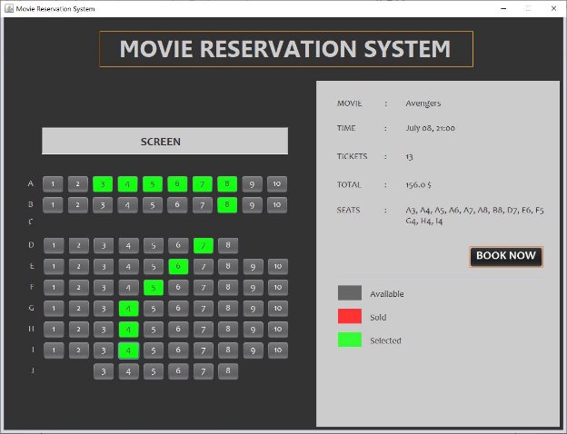
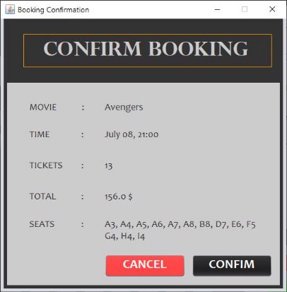
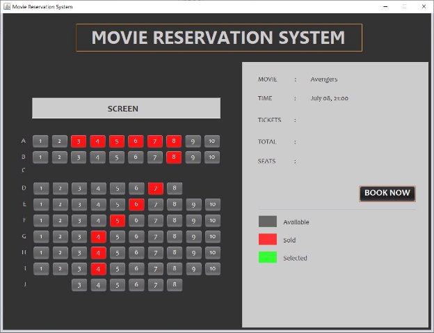
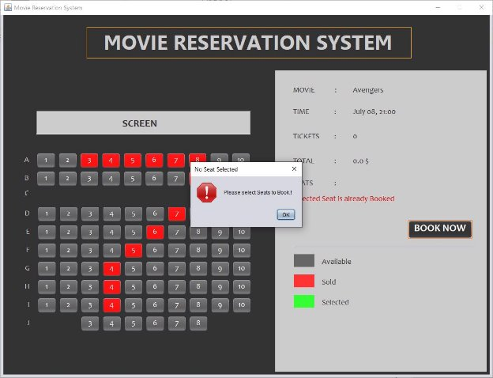
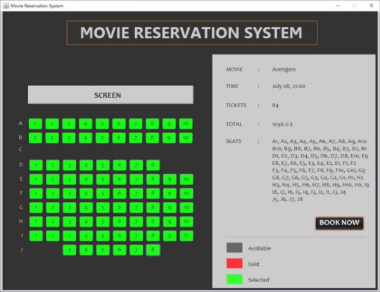
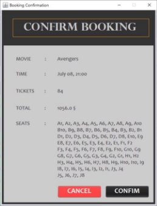
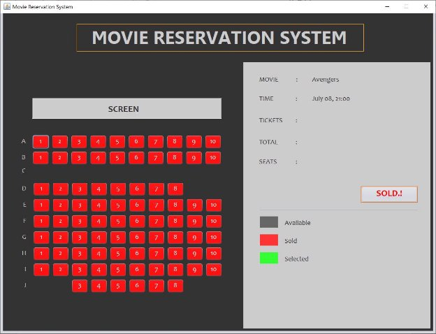

**PART 01: JUSTIFICATION FOR CHOICE OF FRAMEWORK AND IDE** 

- **Used Framework: Swing**  
- **Used IDE: Apache NetBeans 12.4** 
1. **JUSTIFICATION FOR CHOICE OF FRAMEWORK**

Spring MVC, JSF, Vaadin are web frameworks which is used in front end of applications. 

Swing framework is used in this particular application because there are many features over AWT. 

Swing has a lot of components provided for UI and those are lightweight (They are written entirely in Java and do not map directly to platform-specific peers). It supports pluggable look and feel and It is easy to incorporate high quality 2D graphics, text, and images in application and applets. And swing programs are portable which means platform independent. It follows MVC (Model View Controller) architecture which makes programming easy.  

But in AWT framework, it doesn’t follow MVC architecture and it doesn’t support a pluggable look and feel. And there are fewer components when comparing to swing framework. AWT is platform dependent and components are heavyweight.  

In case of community support, there is a huge community using swing framework. So, it is easy to troubleshoot errors in the program with the community support. There are plenty of resources to learn swing including the EC5080 module. And also, it is easy to use. 

By considering all the above factors, I went with Swing framework to implement this particular booking application. 

2. **JUSTIFICATION FOR CHOICE OF IDE**

In this project, Apache NetBeans 12.4 IDE is used to implement the application. 

Since, NetBeans is free, open source, cross-platform, feature-rich, easy to use and a powerful IDE, it is popular and widely used for developing Java applications by millions of developers around the world.  So, there is a huge community support. 

There is a powerful autosuggestion system in NetBeans IDE. And the UI is very user friendly.  

When it comes to java UI designing with swing framework, NetBeans IDE is              significant. It just needs to drag and drop the swing components to the frame. The code for the components is generated automatically by the NetBeans IDE. The component     attributes can also be changed by NetBeans UI itself. This saves lot of time. So, I could able to focus on the application functionality rather than struggling with UI coding.          NetBeans IDE takes care of application front end whereas developer can put full effort to engage with functionality. So, it is very easy to design java UI using NetBeans IDE.  

In IntelliJ IDEA, it is not much easy to Design Java UI using swing framework when compared to NetBeans IDE. There are some difficulties in IntelliJ when dragging and dropping components. The process is not smoother in IntelliJ as in NetBeans. 

In NetBeans there is a “History” tab to explore the previous versions of the application. It compares the code with previous version and newer version. This is very helpful for developers. 

By considering above all the factors, I went with Apache NetBeans 12.4 as the IDE to build this application. 

**PART 02: PROBLEMS** **THAT ARISE AND SOLUTIONS** 

**TABLE 01: PROBLEMS THAT ARISE AND THE WAYS TO CAME ACROSS** 

|**PROBLEM** |**HOW DID I OVERCOME** |
| - | - |
|￿  Dashboard.java file was deleted mistakenly by me.  |￿  I used “History” of the project in NetBeans which is very useful feature to recover the deleted java program. |
|￿  When too much seats are selected, the seats label displays texts out of the frame size.  Which means it disappears the last selected seats. Those are out of the frame size. This was occurred both Dashboard page and Booking Confirmation page. |
- I used <html> “10 seats”   “10 seats” … </html> format to break the lines in selected seats 10 by 10. Finally, all the 84 seats can be selected, displaying all the selected seats. 

- In Booking confirmation page, I resized the frame size to preferred size of the Panel which contains the selected seats. Then the confirmation frame size corresponds to the preferred size of the inner panel making the page responsive to any number of seat bookings. 
|
**PART 03: GUI AND FUNCTIONALITY EXPLANATION** 

1. **GUI** 
- At the left side, the format/ layout of the movie theater is displayed.  
- The rows are named according to the alphabet while columns are named as numbers to track the seats more easily. 
- At the right side, the details of the movie and the selected seats details are displayed. 
- Selected seats are displayed 10 seats per row to display it more clearly to the user.** 
- There is a “BOOK NOW” button to book the selected seats. 

**FIGURE 01: DASHBOARD PAGE** 

- In booking confirmation page, it displays the information related to the movie such as the name of the movie and the time is to be screened.
- And also it displays the selected seats information such as number of tickets to be purchased, the total amount and the identity (seat number) of the each selected seat.
- There are two buttons “CANCEL” and “CONFIRM”.
- “CANCEL” button cancels the booking and “CONFIRM” button confirms the booking.

**FIGURE 02: BOOKING CONFIRMATION PAGE** 

2. **FUNCTIONALITY** 
- The seats to book should be selected.**  
- When a seat is clicked, it turns into green, which is “selected” state.**  
- When green colored seat is clicked again, it will turn into grey, which is “not selected” state.**  
- At the right side of the window, it displays the number of tickets to buy, the selected seats, and the total cost for the selected seats realtime.** 

**FIGURE 03: WHEN MULTIPLE SEATS ARE SELECTED** 

- When “BOOK NOW” button is clicked, “Booking Confirmation Page” will appear displaying all the information related to current booking to confirm the booking. 

**FIGURE 04: FUNCTIONALITY BOOKING CONFIRMATION PAGE** 

- This window (FIGURE 04) is responsive to any number of seats. It resizes according to the preferred size. 
- In this frame, user can confirm the booking by clicking “CONFIRM” or else cancel the booking by clicking “CANCEL” button. 
- When user clicked on “CANCEL” button, the frame will dispose doing nothing. 
- When user clicked on “CONFIRM” button, it will confirm the booking and redirects to the Dashboard. 
- When the booking confirmed, the selected seats turn into red in Dashboard Page. 

**FIGURE 05: WHEN BOOKING CONFIRMED** 

- When ever anyone try to select the red colored seats (seats which are already booked), it shows an error message to the user. 

**FIGURE 06: ERROR MESSAGE WHEN TRYING TO SELECT ALREADY BOOKED SEAT** 

- If the user selected no seat and click “BOOK NOW” button, it will show error message to warn the user. 

**FIGURE 07: ERROR MESSAGE WHEN TRYING TO BOOK NO SEAT** 

- It is capable of selecting and booking all the seat at once.  

**FIGURE 08: DASHBOARD WHEN ALL THE SEATS ARE SELECTED AT ONCE.** 

**FIGURE 09: BOOKING CONFIRMATION PAGE WHEN ALL THE SEATS ARE SELECTED AT ONCE.** 

- When all the seats are booked, the “BOOK NOW” button will disable showing “SOLD.!”. 

**FIGURE 10: DASHBOARD WHEN ALL THE SEATS ARE BOOKED** 

- When the user tries to select seats when all the seats are booked, an error message is displayed informing user that “All seats are booked”. 

**FIGURE 11: ERROR MESSAGE WHEN ALL THE SEATS ARE BOOKED** 
